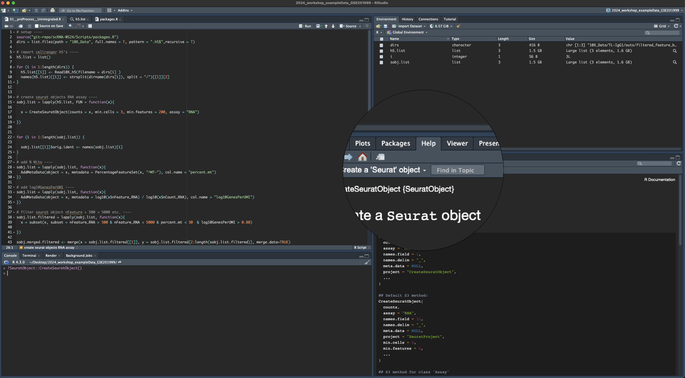
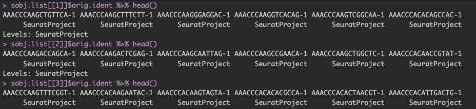
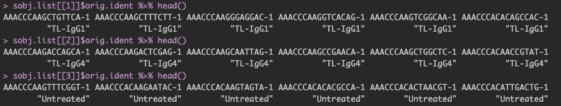
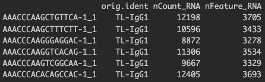
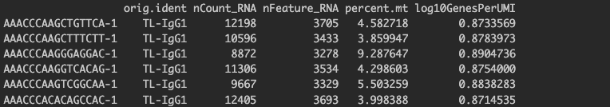
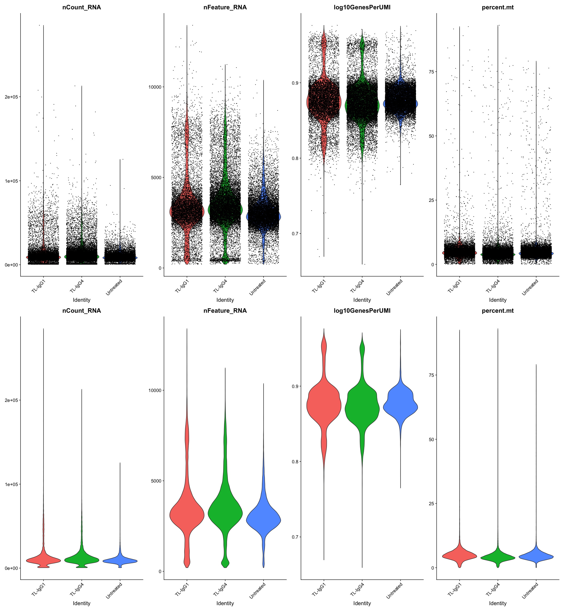
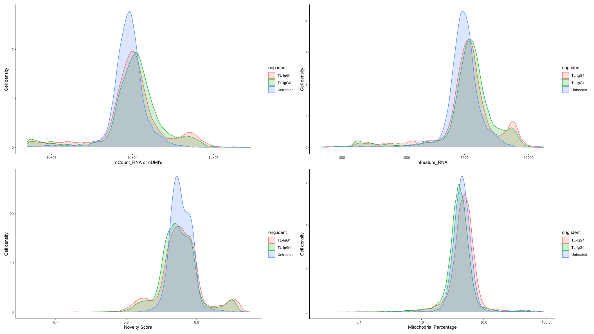

> [!Tip]
Useful Links:
[Seurat Version 5 Command Cheat Sheet](https://satijalab.org/seurat/articles/essential_commands)


### Cellranger Output

This week we will start with the complete cellranger outputs that are conveniently available for us to download from the following path: `/workdir/sc_workshop_2024/GSE201999_output`
Please note that in Week1, we were using a downsampled version of the dataset and we can ignore those outputs for this exercise. 

It is important to note that **cellranger** creates a new directory for each sample and there are many files/subfolders that are created within that directory.
The count matrices produced by cellranger are located in the `./sampleName/outs/` directory. <br> For Seurat analysis we will be using the file named `filtered_feature_bc_matrix.h5` for each sample.

<hr>
<br>


# 1. Create Seurat Object

In an Rstudio session create a new project.

Before we get started, we must set up a working directory where all of our Seurat outputs will be stored. To do this we can use `mkdir` and `setwd` functions. 
In the R console (bottom left pannel), type the following code:

*Please replace `NetID` with your actual NetID before running the code:*
```
# this creates a new directory named Seurat in your workdir ----
system("mkdir /workdir/NetID/Seurat")
```

```
# this will set your Rstudio working directory to the Seurat directory that we created in the previous step ----
setwd("/workdir/NetID/Seurat")
```
Create a new R script using the File --> New File --> Rscript or Shift/Cmd|Ctrl/N <br> 
To get started, we will need a path from where the 10x outputs are accessible. Use the following code chunk to populate the dirs variable:


```
# this assumes your 10x data is in Rstudio_Project_Directory/10X_Data/sampleName/outs/ directory 
# edit the path argument as needed 

dirs = list.files(path = "/workdir/sc_workshop_2024/GSE201999_output", full.names = T, pattern = "filtered_feature_bc_matrix.h5", recursive = T)

# run dirs to confirm the path of h5 filtered matrices
dirs

```

Use the following code chunk to load all R libraries that are required to run the analysis.

```
library(Seurat)
library(SeuratWrappers)
library(ggplot2)
library(patchwork)
library(glmGamPoi)
library(dplyr)

```


Once all libraries are loaded, we will create a seurat object from all samples using `Seurat::Read10X_h5()` and `SeuratObject::CreateSeuratObject()` functions. 

```
# first we initialize an empty R list object and load in all h5 matrices per sample as a list using a for loop 

# initialize an empty list 
h5.list = list()

# looping over total number of samples (in this case 3) and storing the h5 matrices in our h5.list object
for (i in 1:length(dirs)) {
  h5.list[[i]] <- Read10X_h5(filename = dirs[i] )
  names(h5.list)[[i]] <- strsplit(dirname(dirs[i]), split = "/")[[1]][2] # might need tweeking for when the 10X outs are outside of Rstudio project dir
}


```


> [!Tip] 
In R console type `?SeuratObject::CreateSeuratObject()` <br>
In the Help panel in RStudio, you will find a list of all available parameters that CreateSeuratObject uses. <br>
Scroll down to the Arguments section, please go through the description of each argument to understand what each argument/parameter does. <br>
You may use the `?` at any point in the R console followed by the name of the function to get help. e.g. ?RunPCA etc. 



Using the h5.list, we will now create seurat objects for each sample. 

```
# create seurat objects RNA assay ----
sobj.list = lapply(h5.list, FUN = function(x){
  
  x = CreateSeuratObject(counts = x, min.cells = 3, min.features = 200, assay = "RNA")
  
})

```

If we run the following code, you may notice that each cellbarcode (regardless of the sample it belongs to) is associated with a generic `SeuratProject` identifier.
```
sobj.list[[1]]$orig.ident %>% head()
sobj.list[[2]]$orig.ident %>% head()
sobj.list[[3]]$orig.ident %>% head()
```




We do not want this because when we merge these seurat objects together (more on this later: Section 1.2), we will loose the <br> cellbarcode --> sample info linkage, hence we will not be able to identify which barcodes came from which sample!!! <br>
Therefore we want each cellbarcode to be associated with the correct sample identifier.  We will use the following helper loop to fix the issue. 

```
# by default SampleName which is represented as the orig.ident metadata variable in a seurat object will be named to 'SeuratProject', 
# we will use the following loop to overwrite that and rename with the sampleID

for (i in 1:length(sobj.list)) {
  sobj.list[[i]]$orig.ident <- names(sobj.list)[i]  
}


```

Run the same code chunk again and see how the results have changed.

```
sobj.list[[1]]$orig.ident %>% head()
sobj.list[[2]]$orig.ident %>% head()
sobj.list[[3]]$orig.ident %>% head()
```



<br>


## 1.1 Add MetaData

When we create a seurat object, there are some slots that are automatically populated within the object.<br> One of these slots is the `meta.data` slot. 
To access this meta.data slot we use the following syntax: `sobj@meta.data`. Lets use the following code to look at the first few lines of the meta.data slot from one of our seurat objects. 

```
head(sobj.list[[1]]@meta.data)
```
Also, try the above code by replacing the index value of 1 to 2 or 3. 



By default, one will always see three columns whose values are mapped to each cellbarcode in a given seurat object. 

These three columns are:
  - `orig.ident`    : this column will contain the sample identity
  - `nCount_RNA`    : this column represents the number of UMIs per cell
  - `nFeature_RNA`  : this column represents the number of genes detected per cell


<br>

For our initial QC, we will mostly use the meta.data slot. (more on this later: Section 2)

Let us now add some other useful metadata to each seurat object as this will help us later when we perform our initial QC checks. 

The first metric that we will add is the percent.mt. Unless it is part of the experimental perturbation, cells with a high percentage of mitochondrial reads are often referred to as dying/unhealthy cells and it is good practice to set a threshold that filters out cells with high proportion of mitochondrial reads. <br>

To do this we can first calculate the proportion of reads mapping to mitochondrial genes. 
> One may also use a similar approach to set up thresholds for chloroplast genes (for plant species), another example would be to calculate proportions for ribosomal genes. 

Seurat has a convenient function called `PercentageFeatureSet()` that will allow us to calculate these proportions. This function takes in a `pattern` argument and calculates proportions for all genes that match the specified pattern in the dataset. Since our goal is to calculate proportions for mitochondrial genes, we will search for any gene identifiers that begin with the pattern `"MT-"` <br>
For each cell, the function takes the sum of counts across all genes (features) belonging to the "MT-" set, and then divides by the count sum for all genes (features). This value is multiplied by 100 to obtain a percentage value.


```
# add % Mito ----
sobj.list = lapply(sobj.list, function(x){
  AddMetaData(object = x, metadata = PercentageFeatureSet(x, "^MT-"), col.name = "percent.mt")
})
```

Another useful metric to add is the Novelty Score for each cell. We can calculate this score by taking a log ratio of nFeature_RNA and nCount_RNA. In other words, this will give us a log10 ratio of genes per UMI. (More on this later: Section 2)

```
# add log10GenesPerUMI ----
sobj.list = lapply(sobj.list, function(x){
  AddMetaData(object = x, metadata = log10(x$nFeature_RNA) / log10(x$nCount_RNA), col.name = "log10GenesPerUMI")
})
```

Now if we view the meta.data slot again, we will see the addition of two more columns that we created with the `AddMetaData` function in the previous commands. 

```
head(sobj.list[[1]]@meta.data)
```



<br>

## 1.2 Merge Seurat Object

To perform further analysis with seurat, another major step that is required for a multi-sample project is to merge all of our seurat objects into one main seurat object. <br> To achieve this, we can use the merge function and merge all 3 seurat objects stored in our sobj.list into one. 

```
sobj <- merge(x = sobj.list[[1]], y = sobj.list[2:length(sobj.list)], merge.data=TRUE)
```

Save the merged seurat object for future access. 

```
saveRDS(sobj, "01_sobj.merged.RDS")
```


# 2. Initial QC

>[!Note]
Any saved RDS objects can be re-imported in R using the `readRDS` function.
e.g. to reload previously saved seurat object one may use the following command <br> `sobj <- readRDS("01_sobj.merged.RDS")`


We will first plot some violin plots and assess how the data looks. Notice that in the features argument of VlnPlot code chunk, we are using all of our meta.data columns. 


```
VlnPlot(sobj, features = c("nCount_RNA", "nFeature_RNA" , "log10GenesPerUMI", "percent.mt"),
    pt.size = 0.1, group.by = "orig.ident", ncol = 4)
```

If you do not wish to display points/dots on the violin plot change `pt.size = 0`

The violin plot should look like one of the following: ( Top Panel = `pt.size = 0.1` , Bottom Panel = `pt.size = 0`)



<br>
Even without the points, it can be sometimes hard to fine-tune the bottom tails of the distributions. To mitigate that, in addition to the violin plots, we can plot the density distributions with `ggplot2`. This will help us inform in choosing appropriate cut-offs for filtering the data. <br> 

To do this, first lets save the meta.data slot of our seurat object to our local R environment. 

```
metadata <- sobj@meta.data

```

This will create a new metadata variable in our R environment, and will populate this variable with the meta.data slot content. 

```
# lets save all of our plots to a variable, and then we can plot them together (the last line in this code chunk)

n_UMI = metadata %>% 
  ggplot(aes(color=orig.ident, x=nCount_RNA, fill= orig.ident)) + 
  geom_density(alpha = 0.2) + 
  scale_x_log10() + 
  theme_classic() +
  ylab("Cell density") 

n_Feature = metadata %>% 
  ggplot(aes(color=orig.ident, x=nFeature_RNA, fill= orig.ident)) + 
  geom_density(alpha = 0.2) + 
  scale_x_log10() + 
  theme_classic() +
  ylab("Cell density") 


log10GenePerUMI = metadata %>% 
  ggplot(aes(color=orig.ident, x=log10GenesPerUMI, fill= orig.ident)) + 
  geom_density(alpha = 0.2) + 
  scale_x_log10() + 
  theme_classic() +
  ylab("Cell density") 
  

percent.mt =  metadata %>% 
  ggplot(aes(color=orig.ident, x=percent.mt, fill= orig.ident)) + 
  geom_density(alpha = 0.2) + 
  scale_x_log10() + 
  theme_classic() +
  ylab("Cell density") 


  

(n_UMI + n_Feature) / (log10GenePerUMI + percent.mt)

```



<hr>

<details>
  <summary> For Advanced Users </summary>

</details>
