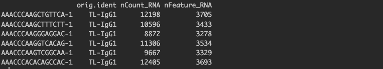
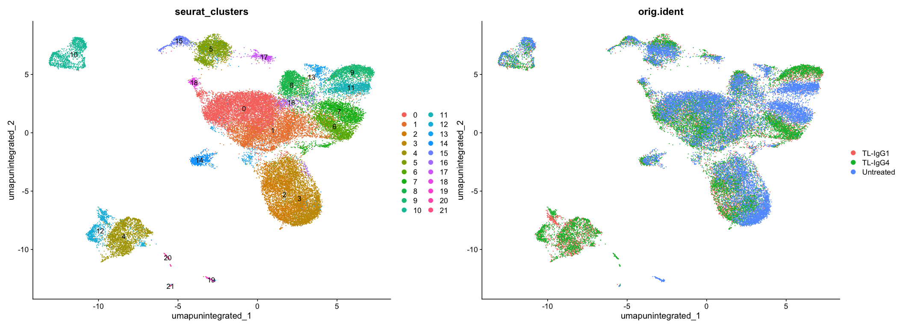

> [!Tip]
Useful Links:<br>
[Seurat Version 5 Command Cheat Sheet](https://satijalab.org/seurat/articles/essential_commands) <br>
[Seurat Object Wiki](https://github.com/satijalab/seurat/wiki)

# Cellranger Output

This week we will start with the complete cellranger outputs that are conveniently available for us to download from the following path: `/workdir/sc_workshop_2024/GSE201999_output`
Please note that in Week1, we were using a downsampled version of the dataset and we can ignore those outputs for this exercise. 

It is important to note that **cellranger** creates a new directory for each sample and there are many files/subfolders that are created within that directory.
The count matrices produced by cellranger are located in the `./sampleName/outs/` directory. <br> For Seurat analysis we will be using the file named `filtered_feature_bc_matrix.h5` for each sample.

<hr>


# Connect and set up the Rstudio environment

1)	Update this link to match the server number (##) assigned to you: 
http://cbsumma##.biohpc.cornell.edu:8016 

2)	Paste the link into a web browser. You should connect to an Rstudio login page.

3)	Login with your BioHPC credentials (same login as connecting to the server). 

<details>
<summary>New to Rstudio? Read this first...
</summary>
<br>
Rstudio will open with 3-4 windows. On the left (or lower left) side is the 'console' window where you can cut-and-paste commands. For these exercies, we will also create an 'Rscript' file to document and comment (#like this) your analysis pipeline. You can open Rscripts later to rerun code on new datasets, or as a draft to rerun analyses with different parameters, for example.
<br><br>
- The Rscript window will open in the top-left panel. This panel can also display objects in other tabs.<br>
- The lower-left panel is the console where the code is executed.<br>
- The top-right panel displays data objects (as well as other tabs).<br>
- The lower-right panel has several tabs to display files, plots (figures), R packages, and help documentation.
We will use all of these panels to build and interact with the dataset in R.<br><br>
Build code in the Rscript panel, adding #comments (preceded by the `#` symbol) that will be ignored when executed. Run code either using the `Run` button in the Rscript file, or by pasting directly into the console (e.g. for testing purposes or quick checks that dont need to be documented in the pipeline).
</details>


4) Before we get started, we must set up a working directory where all of our Seurat outputs will be stored. To do this we can use `mkdir` and `setwd` functions. 
In the R console (bottom left panel), type the following code:

*Please replace `userID` with your BioHPC UserID before running the code*
```
# this creates a new directory named Seurat in your workdir ----
system("mkdir /workdir/userID/Seurat")
```
<details>
<summary> Alternative option
</summary>
<i>Alternatively, you can use the 'Files' tab in the lower right panel to navigate to and create a new directory in your `/workdir/userID/` working directory.</i>
</details>

```
# this will set your Rstudio working directory to the Seurat directory that we created in the previous step ----
setwd("/workdir/userID/Seurat")
```
<details>
<summary> Alternative option
</summary>
Alternatively, you can use the 'Files' tab in the lower right panel to navigate to the new `Seurat` directory and then the 'More' menu to `Set As Working Directory`.
</details>

5) Create a new R script using the top menu: File --> New File --> Rscript or Shift/Cmd|Ctrl/N. This will create a new file in the upper left panel where you can build your code, before running it in the console panel.
   Please make sure to save this script periodically using `Cmd|Ctrl+S`. 

> [!Tip]
Cut and paste code blocks (with comments, or add you own) to the Rscript file (top-left window) to build and document the code for the analysis pipeline. Run code by clicking the `Run` button in the Rscript file to execute the line after the cursor location (or highlight the rows you want to execute and click `Run`).
>
<hr>

# 1. Create Seurat Object

1). To get started, we will need a path from where the 10x outputs are accessible. Use the following code chunk to populate the dirs variable:

```
dirs = list.files(path = "/workdir/sc_workshop_2024/GSE201999_output", full.names = T, pattern = "filtered_feature_bc_matrix.h5", recursive = T)
```

2). Check that the 'dirs' object has the correct paths by typing `dirs` in the console. You should see the following ouput:

```
[1] "/workdir/sc_workshop_2024/GSE201999_output/TL-IgG1/outs/filtered_feature_bc_matrix.h5"  
[2] "/workdir/sc_workshop_2024/GSE201999_output/TL-IgG4/outs/filtered_feature_bc_matrix.h5"  
[3] "/workdir/sc_workshop_2024/GSE201999_output/Untreated/outs/filtered_feature_bc_matrix.h5"
```

3). Use the following code chunk to load all R libraries that are required to run the analysis.

```
library(Seurat)
library(SeuratWrappers)
library(ggplot2)
library(patchwork)
library(glmGamPoi)
library(dplyr)

```

<details>
<summary> Reminder
</summary>
<i>It is always a good habbit to check if all of the libraries needed for the analysis are loaded in the R environment. If you close your Rstudio session often times it will require you to re-load the necessary libraries.<br>
And when you analyze scRNAseq data after the workshop, you may need to install these packages in Rstudio before you can load and use them.</i>
</details>

4). Once all libraries are loaded, we will create a seurat object from all samples using `Seurat::Read10X_h5()` and `SeuratObject::CreateSeuratObject()` functions. 


>[!Tip]
The following code block can be copied and pasted into your Rscript and each line run stepwise. Watch to see the new data objects appear in the upper right `Environment` window.

```
# first we initialize an empty R list object and load in all h5 matrices per sample as a list using a for loop 

# initialize an empty list 
h5.list = list()

# looping over total number of samples (in this case 3) and storing the h5 matrices in our h5.list object
for (i in 1:length(dirs)) {
  h5.list[[i]] <- Read10X_h5(filename = dirs[i] )
  names(h5.list)[[i]] <- strsplit(dirname(dirs[i]), split = "/")[[1]][5] 
}


```


> [!Tip] 
In R console type `?SeuratObject::CreateSeuratObject()` <br>
In the Help panel in RStudio, you will find a list of all available parameters that CreateSeuratObject uses. <br>
Scroll down to the Arguments section, please go through the description of each argument to understand what each argument/parameter does. <br>
You may use the `?` at any point in the R console followed by the name of the function to get help. e.g. ?RunPCA etc. 


5). Using the h5.list, we will now create seurat objects for each sample. 

```
# create seurat objects RNA assay ----
sobj.list = lapply(h5.list, FUN = function(x){
  
  x = CreateSeuratObject(counts = x, min.cells = 3, min.features = 200, assay = "RNA")
  
})

```
<i>Note that we are filtering the datasets at the time each is loaded into Seurat to require minimum criteria.</i>

By running the following code as a quick check in the console, you may notice that each cellbarcode (regardless of the sample it belongs to) is associated with a generic `SeuratProject` identifier.
```
sobj.list[[1]]$orig.ident %>% head()
sobj.list[[2]]$orig.ident %>% head()
sobj.list[[3]]$orig.ident %>% head()
```


These names need to be updated because when we merge these seurat objects together (more on this later: [Section 1.2](#12-merge-seurat-object) ), otherwise we will lose the association between the <br> <b>cellbarcode <--> sample of origin</b><br> and will not be able to identify which barcodes came from which sample!!! <br>
Therefore we want to make sure that each cellbarcode is associated with the correct sample identifier.  We will use the following helper loop to fix the issue. 

```
# by default SampleName which is represented as the orig.ident metadata variable in a seurat object will be named to 'SeuratProject', 
# we will use the following loop to overwrite that and rename with the sampleID

for (i in 1:length(sobj.list)) {
  sobj.list[[i]]$orig.ident <- names(sobj.list)[i]  
}


```

6). Run the same code chunk again in the console and see how the results have changed.


```
sobj.list[[1]]$orig.ident %>% head()
sobj.list[[2]]$orig.ident %>% head()
sobj.list[[3]]$orig.ident %>% head()
```


<br>


## 1.1 Add MetaData

When we create a seurat object, there are some slots that are automatically populated within the object.<br> One of these slots is the `meta.data` slot. 
To access this meta.data slot we use the following syntax: `sobj@meta.data`. Use the following code as a quick check in the console to look at the first few lines of the meta.data slot from one of our seurat objects. 

```
head(sobj.list[[1]]@meta.data)
```
<i>Rerun the above code and replace the index value [[#]] with `2` or `3`. What changes?</i>



By default, the metadata slot will have three columns representing each cellbarcode in a given seurat object. 

These three columns are:
  - `orig.ident`    : this column will contain the sample identity
  - `nCount_RNA`    : this column represents the number of UMIs (distinct transcipts) detected per cell
  - `nFeature_RNA`  : this column represents the number of genes detected per cell

<details>
<summary> Alternative option
</summary>
<i>Alternatively, you can view the `metadata` slots by clicking on the magnifying glass symbol to the right of the ojbect in the `Environment` tab (upper-right panel). The object will open as a tab in the upper-left panel, and you can expand (or close) slots with the arrowheads. This window is a good way to get familiar with the seurat object data structure.</i>
</details>


<br>

For our initial QC, we will mostly use the meta.data slot. (more on this later: [Section 2](#2-initial-qc) )

Let us now add some other useful metadata to each seurat object as this will help us later when we perform our initial QC checks. 

The first metric that we will calculate and add as a metadata slot is the percent.mt. Unless it is expected as part of the experimental perturbation, cells with a high percentage of mitochondrial reads are often considered to be dying/unhealthy cells and it is good practice to set a threshold that filters out cells with high proportion of mitochondrial reads. <br>

To do this we can first calculate the proportion of reads per cellbarcode that map to mitochondrial genes. 
> <i>A similar approach can be used to calculate and filter for the percent expression chloroplast genes (for plant species), another example would be to calculate the percent expression for ribosomal genes.</i> 

Seurat has a convenient function called `PercentageFeatureSet()` that will allow us to calculate these proportions. This function takes in a `pattern` argument and calculates proportions for all genes that match the specified pattern in the dataset. Since our goal is to calculate proportions for mitochondrial genes, we will search for any gene identifiers that begin with the pattern `"MT-"`. 
><i>Note that this strategy relies on human mitochondrial genes all having gene symbols that start with `"MT-"` (case-sensitive), and this pattern may need to be adjusted for other species (e.g. mouse may be `"Mt-"`)</i>


For each cell, the function takes the sum of counts across all genes (features) belonging to the "MT-" set, and then divides by the count sum for all genes (features). This value is multiplied by 100 to obtain a percentage value.


```
# add % Mito ----
sobj.list = lapply(sobj.list, function(x){
  AddMetaData(object = x, metadata = PercentageFeatureSet(x, "^MT-"), col.name = "percent.mt")
})
```

Another useful metric to add is the Novelty Score for each cell. We can calculate this score by taking a log ratio of nFeature_RNA and nCount_RNA. In other words, this will give us a log10 ratio of genes per UMI. (More on this later: [Section 2.1](#21-novelty-score) )

```
# add log10GenesPerUMI ----
sobj.list = lapply(sobj.list, function(x){
  AddMetaData(object = x, metadata = log10(x$nFeature_RNA) / log10(x$nCount_RNA), col.name = "log10GenesPerUMI")
})
```

Now if we view the meta.data slot again, we will see the addition of two more columns that we created with the `AddMetaData` function in the previous commands. 

```
head(sobj.list[[1]]@meta.data)
```


<br>

## 1.2 Merge Seurat Object

To perform further analysis with seurat, another major step that is required for a multi-sample project is to merge all of our seurat objects into one main seurat object. <br> To achieve this, we can use the merge function and merge all 3 seurat objects stored in our sobj.list into one. 

```
sobj <- merge(x = sobj.list[[1]], y = sobj.list[2:length(sobj.list)], merge.data=TRUE)
```

Save the merged seurat object for future access. 

```
saveRDS(sobj, "01_sobj.merged.RDS")
```
>[!Note]
Any saved RDS objects can be re-imported in R using the `readRDS` function.
e.g. to reload previously saved seurat object one may use the following command <br> `sobj <- readRDS("01_sobj.merged.RDS")`


# 2. Initial QC


We will first plot some violin plots and assess how the data looks. Notice that in the features argument of VlnPlot code chunk, we are using all of our meta.data columns. 


```
VlnPlot(sobj, features = c("nCount_RNA", "nFeature_RNA" , "log10GenesPerUMI", "percent.mt"),
    pt.size = 0.1, group.by = "orig.ident", ncol = 4)
```

If you do not wish to display points/dots on the violin plot change `pt.size = 0`

The violin plot should look like one of the following: ( Top Panel = `pt.size = 0.1` , Bottom Panel = `pt.size = 0`)


<br>
Even without the points, it can be sometimes hard to fine-tune the bottom tails of the distributions. To mitigate this (in addition to the violin plots), we can plot the density distributions for each sample with `ggplot2` . This will help us inform in choosing appropriate cut-offs for filtering the data. <br> 

To do this, first lets save the meta.data slot of our seurat object to a variable for easy access. 

```
metadata <- sobj@meta.data

```

This will create a new metadata variable in our R environment, and will populate this variable with the meta.data slot content. 

><i> The `metadata` dataframe is small, compared to the seurat object! It can be viewed in the upper-left panel by clicking on the table icon on the right side of the `metadata` row in the `Environment` tab in the upper-right panel.</i>
```
# lets save all of our plots to a variable, so we can plot them together in one plot (the last line in this code chunk) ----

n_UMI = metadata %>% 
  ggplot(aes(color=orig.ident, x=nCount_RNA, fill= orig.ident)) + 
  geom_density(alpha = 0.2) + 
  scale_x_log10() + 
  theme_classic() +
  ylab("Cell density") +
  xlab("nCount_RNA or nUMI's")

n_Feature = metadata %>% 
  ggplot(aes(color=orig.ident, x=nFeature_RNA, fill= orig.ident)) + 
  geom_density(alpha = 0.2) + 
  scale_x_log10() + 
  theme_classic() +
  ylab("Cell density") +
  xlab("nFeature_RNA")


log10GenePerUMI = metadata %>% 
  ggplot(aes(color=orig.ident, x=log10GenesPerUMI, fill= orig.ident)) + 
  geom_density(alpha = 0.2) + 
  theme_classic() +
  ylab("Cell density") +
  xlab("Novelty Score ")
  

percent.mt =  metadata %>% 
  ggplot(aes(color=orig.ident, x=percent.mt, fill= orig.ident)) + 
  geom_density(alpha = 0.2) + 
  scale_x_log10() + 
  theme_classic() +
  ylab("Cell density") +
  xlab("Mitochodrial Percentage ")


  

(n_UMI + n_Feature) / (log10GenePerUMI + percent.mt)

```


<br>

> The density plots will show the distribution of the metadata metrics for each sample. What patterns do you notice?

## 2.1 Novelty Score 

In section 1.1, we calculated `log10GenesPerUMI`, by taking a log10 ratio of nFeature_RNA to nCount_RNA. This metric that we calculated is referred to as the Novelty Score and provides insights for the complexity of the RNA molecules that were sequenced in a given cell. For instance, in our data-set, there can be cells that have super hight total UMI counts, however the features that are associated with those counts are rather low. This basically tells us that for these cells, a handful of RNA molecules were sequenced over and over rendering these cells as not a true representation of the population they came from. For most scRNA-seq experiments, we expect this score to be 0.8 or higher. Hence any cell in our data-set with a Novelty Score of < 0.8 will be filtered out in our filtering step. 


# 3. Filtering Seurat Object

Please note that for this example dataset, we will use the following criteria:

  - nFeatures > 1000
  - nFeatures < 9000
  - log10GenesPerUMI > 0.8
  - percent.mt < 20

We will create a new (filtered) seurat object by using the `subset` function, which will allow us to set the aforementioned filtering criteria:

```
#filter the seurat object based on counts distributions
#the goal is to trim outlier cellbarcodes that may be dead/dying cells, doublets, or not representative of the biological state of the sample.

sobj.filtered <- subset(sobj, subset = nFeature_RNA > 1000 & nFeature_RNA < 9000 & percent.mt < 20 & log10GenesPerUMI > 0.80)

```
Save the filtered seurat object for future easy access:

```
saveRDS(sobj.filtered, "02_filtered_seurat_object.RDS")
```

> [!Note]
Investigate the new filtered seurat object using what you have learned above. What is similar or different?<br>

## 3.1 Running Seurat Standard Pipeline


In this section, we will build the (merged + filtered) seurat object for biological data mining. Some steps may take a few minutes to complete. The full code block is included below with in-line comments to save in your R script.

For the workshop, we will focus on the default (original) Seurat pipeline, using LogNormalize. If you are interested in using the SCTransform method, you can try this later -- see notes below.

The following steps will add new data slots to the `sobj.filtered` seurat object. You can monitor these either through the console or by viewing (and refreshing!) the object in the top-left panel.


Quick summary:
- NormalizeData: normalize the counts for each sample to account for sequencing depth
- FindVariableFeatures: find the genes (features) with the most variable detection (HVGs), accounting for the level of detection (genes with low noisy counts are excluded), and store this list for future reference
- ScaleData: calculate Z-scores (the spread of the normalized counts across cells) for all genes

<i>The following steps cluster the dataset using <b>only</b> the HVGs, but without integrating the samples. We are running these steps as an example of the results of clustering without integration. The parameters passed in to each step link to the previous calculations/data slots.</i>
- RunPCA: calculate the top 50 principal components for HVGs
   ><i>ElbowPlot: visualize the PC analysis as an 'elbow plot'</i>
- FindNeighbors: calculate the Shared Nearest Neighbors based on the PCs from the previous step
- FindClusters: assign cells to clusters
- RunUMAP: generate a UMAP visualization
   ><i>DimPlot: visualize the UMAPs in 2 ways</i>

<details>
<summary> Accessing previous plots in Rstudio
</summary>
You can access the history of plots you have made in the `plots` tab (lower right panel) using the arrow keys in the top left corner of that panel. This avoids having to regenerate the plot from the console!
</details>

<b>Code block:</b>

```
# run standard anlaysis workflow ---- 
# Using LogNormalize Method to Normalize our data ----

sobj.filtered <- NormalizeData(sobj.filtered, normalization.method = "LogNormalize", verbose = T)

# Finding Top 3000 High Variable features using the Variance Stabilized Transformation ----

sobj.filtered <- FindVariableFeatures(sobj.filtered, nfeatures = 3000, selection.method = "vst", verbose = T)

# Scaling (Calculating Z-scores), these are helpful to use for plotting e.g. Heatmaps ----
# By default, ScaleData only scales variable features, but we can do this for all genes 
# This helps with visualization of genes that are not part of HVG's 

all.genes <- rownames(sobj.filtered)
sobj.filtered <- ScaleData(sobj.filtered, features = all.genes)

# Running Principal Components Analysis ---- 
sobj.filtered <- RunPCA(sobj.filtered, npcs = 50, verbose = T)

ElbowPlot(sobj.filtered, ndims = 50, reduction = "pca")

# Calculating Shared Nearest Neighbors (SNN's) ----
sobj.filtered <- FindNeighbors(sobj.filtered, dims = 1:50, reduction = "pca")

# Finding Clusters using the Louvain Clustering Algorithm (default) followed by UMAP ----
sobj.filtered <- FindClusters(sobj.filtered, resolution = 0.4, cluster.name = "unintegrated_clusters", verbose = T)
sobj.filtered <- RunUMAP(sobj.filtered, dims = 1:50, reduction = "pca", reduction.name = "umap.unintegrated")

# Plotting UMAP
u1 = DimPlot(sobj.filtered, group.by = "seurat_clusters", label = T)
u2 = DimPlot(sobj.filtered, group.by = "orig.ident")

u1 | u2
```
After you complete the code block above, your UMAPs should look like the following images. 
<br>
<i> Are you happy with the clustering?


<hr>

<details>
  <summary> Optional next steps </summary>

- Use SCTransform to analyze your Seurat object.
   - [This link](https://satijalab.org/seurat/articles/sctransform_vignette#apply-sctransform-normalization) will take you to the Seurat Vignette for SCTransform
   > To use SCTransform on the exercise data-set, you can start by loading the merged + filtered seurat object <br>
   > sobj.sct <- readRDS("02_filtered_seurat_object.RDS")
   > You may start where you see the `#run sctransform` comment. Replace pbmc with `sobj.sct`  

</details>
