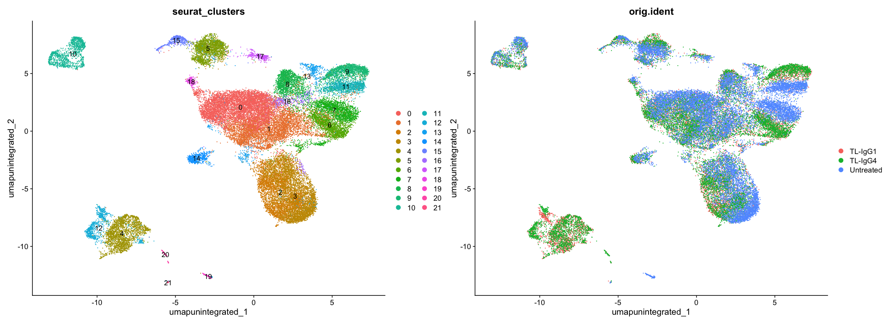
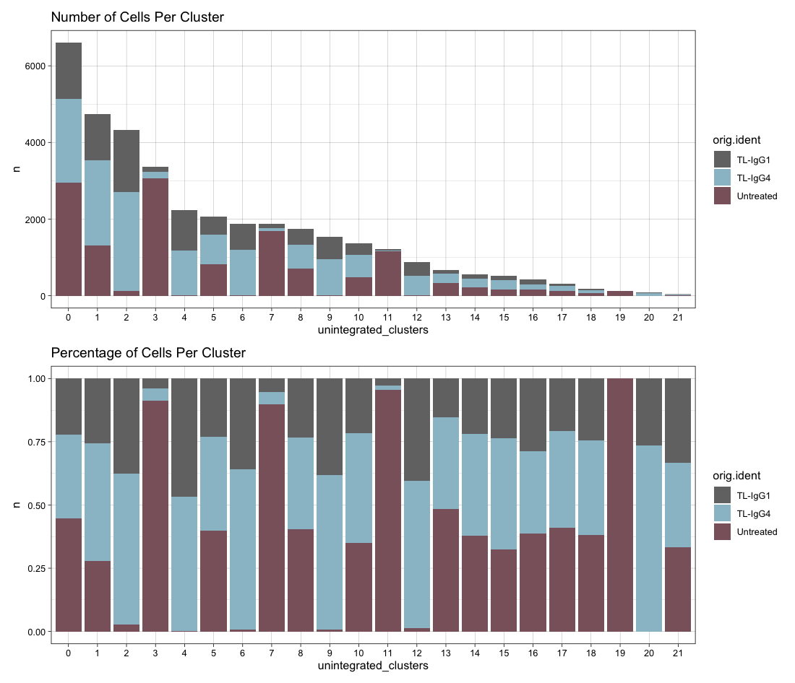

In this exercise, we will explore ways to understand the quality of our clustering that we obtained using the standard analysis last week. 

These procedures will help us identify any problems that we may need to correct before we dive into the downstream biological analysis e.g. FindMarkers / Differential Gene Expression Tests etc. 

<hr>

# 1. Import Seurat Object

Let's begin by first importing our seurat object into our R environment and plotting the umaps that we obtained from our standard analysis last week. <br>
This is the object that we saved at the end of our last session. 

```
sobj <- readRDS("03_sobj.clustered.RDS")

# Plotting UMAP
u1 = DimPlot(sobj, group.by = "seurat_clusters", label = T)
u2 = DimPlot(sobj, group.by = "orig.ident")

u1 | u2
```



In the first panel, we observe that at current resolution of `0.4`, we have a total of `22` distinct clusters. <br>
In the second panel, we see the same UMAP, however we have overlayed it with the sample information, in this case 3 samples. In this view we see how the clusters are represented by each sample. 

If we take a closer look, we may observe, there are certain clusters that are dominated by the `Untreated` sample and are not really well mixed with the two treatment samples. 

This is a first indication that we may need to perform integration to align the cell types from all samples in a manner where all clusters have a decent representation from all samples/conditions.

> In some experiments e.g. in studies where we profile certain types of cancers, we may expect a lot of heterogeneity and in that case if we see a cluster only represented by cancer cells in comparison to normal cells, it may be biologically relevant. 

Lets now use the following code to investigate cluster membership by sample and visualize it in various ways: 

```
# Get Number of cells per sample within each cluster ---- 
n_cells <- FetchData(sobj, 
                     vars = c("unintegrated_clusters", "orig.ident")) %>%
                      dplyr::count(unintegrated_clusters, orig.ident)

# Barplot of number & proportions of cells per cluster by sample
ns1 = ggplot(n_cells, aes(x=unintegrated_clusters, y=n, fill=orig.ident)) +
  geom_bar(position="stack", stat="identity") + 
  scale_color_manual(values = c("grey45", "lightblue3", "pink4"), aesthetics = c("colour", "fill")) +
  theme_linedraw() + ggtitle("Number of Cells Per Cluster")

ns2 = ggplot(n_cells, aes(x=unintegrated_clusters, y=n, fill=orig.ident)) +
  geom_bar(position="fill", stat="identity") +  
  scale_color_manual(values = c("grey45", "lightblue3", "pink4"), aesthetics = c("colour", "fill")) + 
  theme_linedraw() + ggtitle("Percentage of Cells Per Cluster")

ns1 / ns2
```


From the above plots we see that there are clusters that are dominated by just the Untreated samples e.g. `Clusters 3, 7, 11, 19`, and there are clusters where Untreated samples has zero to very less membership e.g. `Clusters 2, 4, 6, 9, 12, 20`. 

This suggests that in our data, cells are being clustered by sample. In order to correct this, we will use `Harmony Integration` as a strategy to fix this issue and hopefully when we look at this QC again on our aligned/integrated dataset, we may find less problems. 


# 2. Harmony Integration 

In Seurat, the main function that we will use for integration is the `IntegrateLayers()` function. 
>[!Tip] 
Use `?IntegrateLayers` in the console to investigate all the arguments supported by this function.
The following Seurat Vignette is also a great resource to learn more about [Seurat Integration Analysis.](https://satijalab.org/seurat/articles/integration_introduction) 

