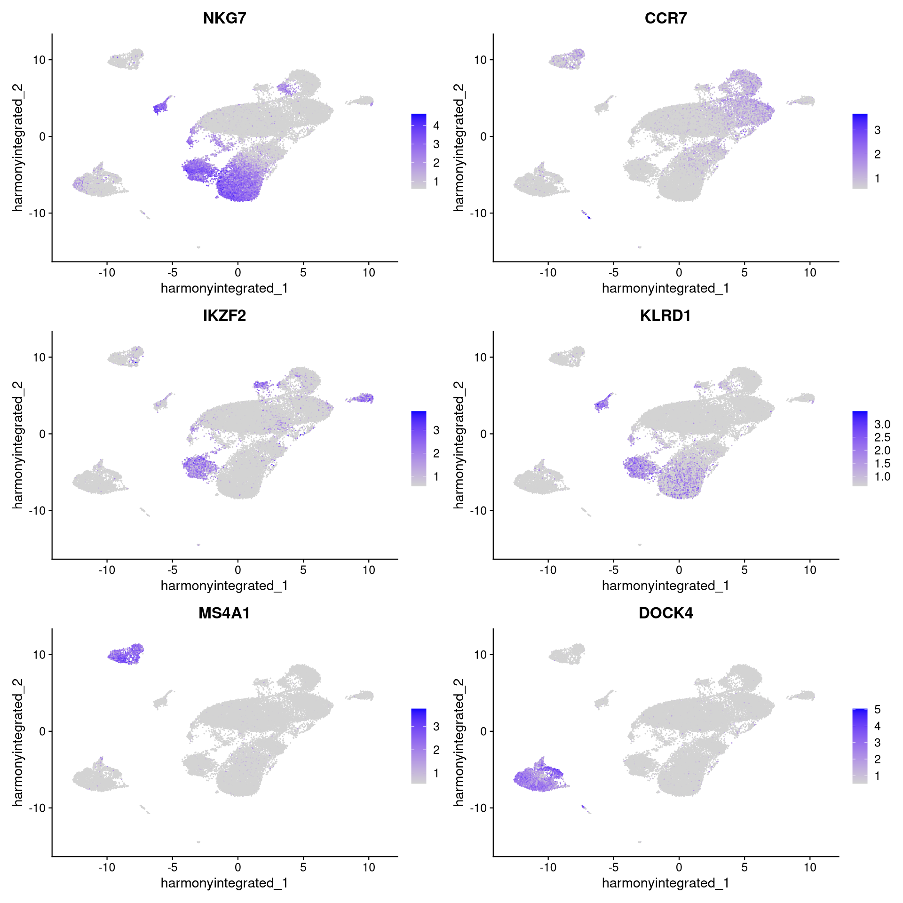
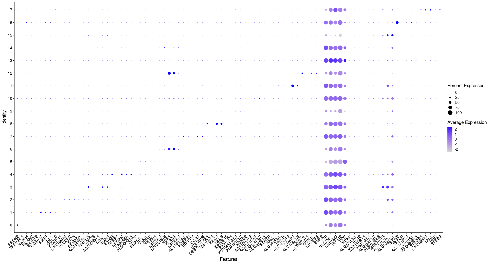

In this exercise, we will explore ways to understand the quality of our clustering that we obtained using the standard analysis last week. 

These procedures will help us identify any problems that we may need to correct before we dive into the downstream biological analysis e.g. FindMarkers / Differential Gene Expression Tests etc. 

<hr>

# 1. Import Seurat Object

If you finished the week 2 exercises, most likely you will already have the `sobj.filtered` object in your environment. If for some reason it is not there, you may alternatively re-load it using the readRDS command. The seurat object from exercise2 is available for access at the following path: `/path/to/sobj.filtered` 

Then, let's start by re-plotting the umaps that we obtained from the end of the exercises last week. <br>

```
# sobj.filtered <- readRDS("/path/to/sobj.filtered/03_sobj.clustered.RDS") # un-comment this line by removing the '#' symbol from the beginning of this line if you would like to use the seurat object that is provided by BioHPC

# Plotting UMAP
u1 = DimPlot(sobj.filtered, group.by = "seurat_clusters", label = T)
u2 = DimPlot(sobj.filtered, group.by = "orig.ident")

u1 | u2
```


In the first panel, we observe that at current resolution of `0.4`, we have a total of `22` distinct clusters. <br>
In the second panel, we see the same UMAP, however we have overlayed it with the sample information, in this case 3 samples. In this view we see how the clusters are represented by each sample. 

Take a closer look, and observe that there are certain clusters that are dominated by the `Untreated` sample and are not really well mixed with the two treatment samples. All of the samples in the workshop dataset were generated from the same PBMC sample and are not expected to have radically different cell types or clusters.

This is a first indication that we may need to perform integration to align the cell types from all samples in a manner where all clusters have a decent representation from all samples/conditions.

> In some experiments, cell type representation may not be consistent across samples. For example, some cancer samples may contain a lot of cell type heterogeneity, and cancer-specific cell types may be biologically relevant. 

Lets now use the following code to investigate cluster membership by sample and visualize it in various ways. Note that we are simply comparing the number of cells per sample within each cluster without additional normalization to the total number of cells per sample, because the total cell counts are fairly similar among samples.

```

# Check the total number of cells per sample
FetchData(sobj.filtered, vars = "orig.ident") %>% dplyr::count(orig.ident)

# Get Number of cells per sample within each cluster ---- 
n_cells <- FetchData(sobj.filtered, 
                     vars = c("unintegrated_clusters", "orig.ident")) %>%
                      dplyr::count(unintegrated_clusters, orig.ident)

# Save barplots of number & proportions of cells per cluster by sample
ns1 = ggplot(n_cells, aes(x=unintegrated_clusters, y=n, fill=orig.ident)) +
  geom_bar(position="stack", stat="identity") + 
  scale_color_manual(values = c("grey45", "lightblue3", "pink4"), aesthetics = c("colour", "fill")) +
  theme_linedraw() + ggtitle("Number of Cells Per Cluster")

ns2 = ggplot(n_cells, aes(x=unintegrated_clusters, y=n, fill=orig.ident)) +
  geom_bar(position="fill", stat="identity") +  
  scale_color_manual(values = c("grey45", "lightblue3", "pink4"), aesthetics = c("colour", "fill")) + 
  theme_linedraw() + ggtitle("Percentage of Cells Per Cluster")

# View barplots
ns1 / ns2
```


From the above plots we see that there are clusters that are dominated by just the Untreated samples e.g. `Clusters 3, 7, 11, 19`, and there are clusters where Untreated samples has zero to very less membership e.g. `Clusters 2, 4, 6, 9, 12, 20`. 

This suggests that in the example dataset, cells are being clustered by sample. In order to correct this, we will use `Harmony Integration` as a strategy to fix this issue and hopefully when we look at this QC again on our aligned/integrated dataset, we may find less problems. 


# 2. Harmony Integration 

In Seurat, the main function that we will use for integration is the `IntegrateLayers()` function. 
>[!Tip] 
Use `?IntegrateLayers` in the console to investigate all the arguments supported by this function.
The following Seurat Vignette is also a great resource to learn more about [Seurat Integration Analysis.](https://satijalab.org/seurat/articles/integration_introduction) 


Lets use the following code chunk to perform integration:

Note that in our case it is not necessary to split our seurat object prior to integration. In cases where a user wants to integrate not by sample but rather than some other category, they must split the seurat object layers first using the split function. See [this](https://satijalab.org/seurat/articles/essential_commands#split-layers) for more details. <br>

### TODO: should the obj name now by sobj.integrated (here and below)??

```
sobj.filtered <- IntegrateLayers(object = sobj.filtered, method = HarmonyIntegration, orig.reduction = "pca", 
                        new.reduction = "harmony_pca",
                        verbose = T)
# Using method=Harmony may generate warnings, these can be ignored

```

After applying the integration function, we can join all layers together using the JoinLayers function for further analysis. 

```
# re-join layers after integration ----
sobj.filtered[["RNA"]] <- JoinLayers(sobj.filtered[["RNA"]])
```

We can now proceed by running the remaining seurat pipeline as is. We will change some parameters and name them a little differently so we can distinguish between unintegrated and harmony integrated components of the seurat object for future access.  

Let's run the following code chunk to get clustering results using the harmony corrected embeddings. Once we create clusters, lets review them side-by-side. 

```
sobj.filtered <- FindNeighbors(sobj.filtered, reduction = "harmony_pca", dims = 1:50)
sobj.filtered <- FindClusters(sobj.filtered, resolution = 0.4, cluster.name = "harmony_clusters")
sobj.filtered <- RunUMAP(sobj.filtered, dims = 1:50, reduction = "harmony_pca", reduction.name = "harmony.integrated")

# The UMAPs for the unintegrated samples were generated in the week 2 exercises and may still be available
# Remove the comment '`#` symbols if the unintegrated UMAPs need to be regenerated
# u1 = DimPlot(sobj.filtered, group.by = "unintegrated_clusters", label = T, label.size = 7, reduction = "umap.unintegrated")
# u2 = DimPlot(sobj.filtered, group.by = "orig.ident",reduction = "umap.unintegrated")

# Save UMAPs for the new integated dataset. 
# If needed, modify the label.size parameter to view on your screen
h1 = DimPlot(sobj.filtered, group.by = "harmony_clusters", label = T, label.size = 7, reduction = "harmony.integrated")
h2 = DimPlot(sobj.filtered, group.by = "orig.ident", reduction = "harmony.integrated")

# View UMAPs
(u1 | u2)  / (h1 | h2)
```


From the above UMAPs, we see that in the harmony integrated clusters, we now see a good representation of all samples within all clusters. There are some clusters e.g. cluster 9 and 5 that have rather few cells from Untreated sample, but overall the sample membership in all the other clusters looks much better. 

We can further validate this by looking at the sample proportions per cluster again. Lets use the following code to compute these and plot unintegrated and integrated results side-by-side

```
# Re-check cell counts per sample per cluster after integration with Harmony
n_cells_h <- FetchData(sobj.filtered, 
                      vars = c("harmony_clusters", "orig.ident")) %>%
  dplyr::count(harmony_clusters, orig.ident)

ns_h1 = ggplot(n_cells_h, aes(x=harmony_clusters, y=n, fill=orig.ident)) +
  geom_bar(position="stack", stat="identity") + scale_color_manual(values = c("grey45", "lightblue3", "pink4"), aesthetics = c("colour", "fill")) + theme_linedraw()

ns_h2 = ggplot(n_cells_h, aes(x=harmony_clusters, y=n, fill=orig.ident)) +
  geom_bar(position="fill", stat="identity") + scale_color_manual(values = c("grey45", "lightblue3", "pink4"), aesthetics = c("colour", "fill"))+ theme_linedraw()

(ns1 / ns2) | (ns_h1 / ns_h2)
```


<details>
  <summary> Optional: play with clustering resolution</summary>
  The appropriate number of clusters for a dataset is somewhat subjective. Try playing with the clustering steps to see how the assignment of cells to clusters changes. The most common parameter to vary is the 'resolution` parameter at the FindClusters() step: a higher resolution value should give more total clusters. <br>
  Some tips: <br>

  * Use a new name for the cluster.name parameter, to avoid overwriting the clusters generated with `resolution = 0.4`
  * You dont need to rerun the RunUMAP() step after rerunning `FindClusters()`, because the UMAP projection does not change
  * `FindClusters()` will save the new cluster values to the `seurat_clusters` metadata slot, as well as in the new `cluster.name` slot
  * You can define the cluster identities to use in following steps with the `Idents()` function 

</details>

Lets save our integrated seurat object to file for future use/access:

```
saveRDS(sobj.filtered , "04_harmony_integrated_res0.4.RDS")
```


# 2. Differential Gene Expression Analysis with FindMarkers

In Seurat, a key function that we will use to determine differences in gene expression between and within clusters is the `FindMarkers()` function. 

First, we will use the related `FindAllMarkers()` function to generate lists of marker genes that distinguish each cluster from all others:

```
# Set idents to make sure next steps use the harmony_clusters with res=0.4
Idents(sobj.filtered) <- sobj.filtered$harmony_clusters

# Install presto to help FindAllMarkers run quickly
devtools::install_github('immunogenomics/presto')

# Find marker genes that disinguish each cluster compared to all other cells
# Use default Wilcox algorithm and default cutoffs for minimum detection and log(fold-change) and 
# Save only the positive marker genes (higher expression in the cluster being tested vs all other cells)
sobj.markers <- FindAllMarkers(sobj.filtered, only.pos = TRUE)

# Check the top marker genes by cluster
sobj.markers %>%
  group_by(cluster) %>%
  dplyr::filter(avg_log2FC > 1)
```
The top results for Cluster 0 should look like the table below. Review the column names at the top to interpret the table (e.g. Cluster # is in the next-to-last column).
```
# A tibble: 19,082 × 7
# Groups:   cluster [18]
   p_val avg_log2FC pct.1 pct.2 p_val_adj cluster gene   
   <dbl>      <dbl> <dbl> <dbl>     <dbl> <fct>   <chr>  
 1     0       2.61 0.931 0.27          0 0       NKG7   
 2     0       2.37 0.855 0.233         0 0       GZMA   
 3     0       2.25 0.946 0.332         0 0       CST7   
 4     0       2.55 0.787 0.182         0 0       C1orf21
 5     0       2.24 0.916 0.337         0 0       SAMD3  
 6     0       1.94 0.998 0.505         0 0       CCL5   
 7     0       3.33 0.577 0.088         0 0       FGFBP2 
 8     0       1.49 0.725 0.238         0 0       GNLY   
 9     0       1.01 0.846 0.371         0 0       ZEB2   
10     0       2.16 0.866 0.396         0 0       TGFBR3 
# … with 19,072 more rows
# ℹ Use `print(n = ...)` to see more rows
```
Count the number of marker genes per cluster with avg_log2FC > 1:
```
# Determine the number of marker genes per cluster with with avg_log2FC > 1
sobj.markers %>%
   group_by(cluster) %>%
   dplyr::filter(avg_log2FC > 1 & p_val_adj < 0.05) %>%
   dplyr::count(cluster)
```
Which shows there are hundreds to thousands of genes with differential expression among clusters:
```
# A tibble: 18 × 2
# Groups:   cluster [18]
   cluster     n
   <fct>   <int>
 1 0         464
 2 1         255
 3 2         297
 4 3         434
 5 4         543
 6 5        4055
 7 6         571
 8 7         166
 9 8        1796
10 9        2505
11 10         88
12 11        363
13 12        607
14 13         23
15 14        290
16 15        292
17 16        182
18 17       2522
```

These results can be saved and/or written to a file:
```
write.csv(sobj.markers, "sobj.markers.csv", quote=F)
```

And marker genes of interest can be visualized on the UMAP:
```
# FeaturePlots for a few top marker genes
FeaturePlot(sobj.filtered,features = c("NKG7","CCR7","IKZF2","KLRD1","MS4A1","DOCK4"))
```



Or in a dot plot:

```
# Example based on Seurat vignette

sobj.markers %>%
     group_by(cluster) %>%
     dplyr::filter(avg_log2FC > 1 & p_val_adj < 0.05) %>%
      arrange(desc(avg_log2FC)) %>% 
       slice_head(n = 5) %>%
       ungroup() -> top5

DotPlot(sobj.filtered, features = unique(top5$gene)) +
  RotatedAxis()

```



Next, we will use one cluster as an example of finding genes that are differentially expressed between samples and within a cell type. Again we use FindMarkers(), but this time defining the sets of cells to compare using orig.ident:
```
# Set the idents to define sets of cells to compare
Idents(sobj.filtered) <- sobj.filtered$orig.ident

# Find DE genes between treated and untreated cells in cluster 1
IgG1_v_UT_Cluster1 <- FindMarkers(sobj.filtered, ident.1 = "TL-IgG1", ident.2 = "Untreated", group.by = "orig.ident", subset.ident = 1, only.pos = F)
```
Genes of interest can be vizualized in different ways, grouped/split by clusters and by samples:
```
# Plot a few top genes in different ways
# UMAP split by sample
FeaturePlot(sobj.filtered,features = c("LYZ","JUNB"), split.by="orig.ident")

# Violin plot with all clusters, split by sample
VlnPlot(sobj.filtered,features = c("LYZ","JUNB"), split.by="orig.ident", pt.size=0)

Idents(sobj.filtered) <- sobj.filtered$harmony_clusters
# Ridge plot comparing samples, just for cells in cluster 1
RidgePlot(sobj.filtered,features = c("LYZ","JUNB"), group.by = "orig.ident", idents=1)
```
## Optional further analyses, guided by Seurat and other vignettes:
- Try other methods to generate an integrated dataset, such as
  -- SCTransform-normalized data (https://satijalab.org/seurat/articles/integration_introduction#perform-integration-with-sctransform-normalized-datasets)
  -- methods other than Harmony
- Find DE genes between samples within each cluster for each pair of samples. Which clusters have the most DE genes between samples? Which pairs of samples have the most different expression within clusters?
- Use SingleR to automate cluster identification <b>TODO: add link to vignette</b>
- Try the Pseudobulk approach for a dataset that has biological replicates, as described in this vignette: https://satijalab.org/seurat/articles/de_vignette
- Use FindMarkers() to generate avg_log2FC values to use in GSEA (gene set enrichment analysis). Note that you will want to retain the results for all expressed genes, not just those with significant adj-p values -- adjust parameters accordingly! <b>TODO: Could use this example as a guide: <b> https://crazyhottommy.github.io/scRNA-seq-workshop-Fall-2019/scRNAseq_workshop_3.html
